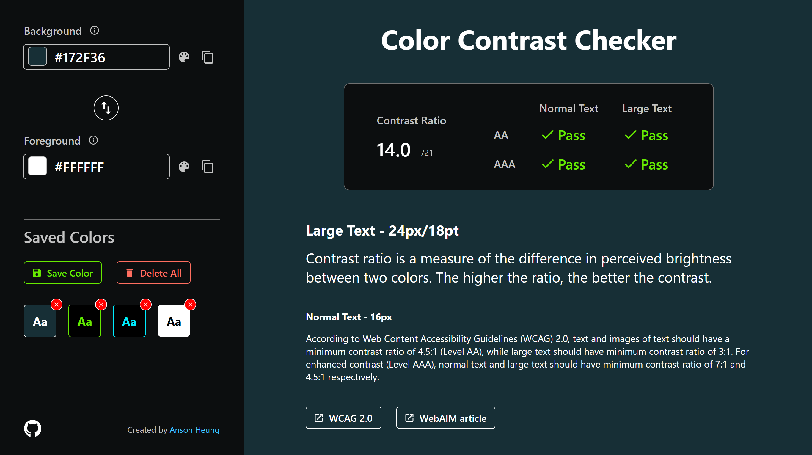

<h1 align="center">Contrast Ratio Checker</h1>
<p align="center">A simple React app that checks the color contrast of your design based on Web Content Accessibility Guidelines (WCAG). 🎨</p>
<div align="center">
  <a href="https://app.netlify.com/sites/color-contrast/deploys">
    
  </a>
</div>



## Features :sparkles:

- :art: Color pickers for color input
- :arrows_counterclockwise: Accepts HEX, RGB and HSL color formats
- :arrows_clockwise: Converts color format to HEX, RGB and HSL
- :man_with_probing_cane: Checks against [WCAG 2.0](https://www.w3.org/TR/UNDERSTANDING-WCAG20/visual-audio-contrast-contrast.html) Level AA and Level AAA requirements
- :floppy_disk: Saves and loads themes from local storage
- :iphone: Responsive design

## Development :hammer_and_wrench:

```bash
# 1. Clone this repository to your local computer
git clone https://github.com/AnsonH/contrast-checker.git

# 2. Change directory to the root of the repo
cd contrast-checker

# 3. Install dependencies
npm install

# 4. Start the development server
npm start
```
